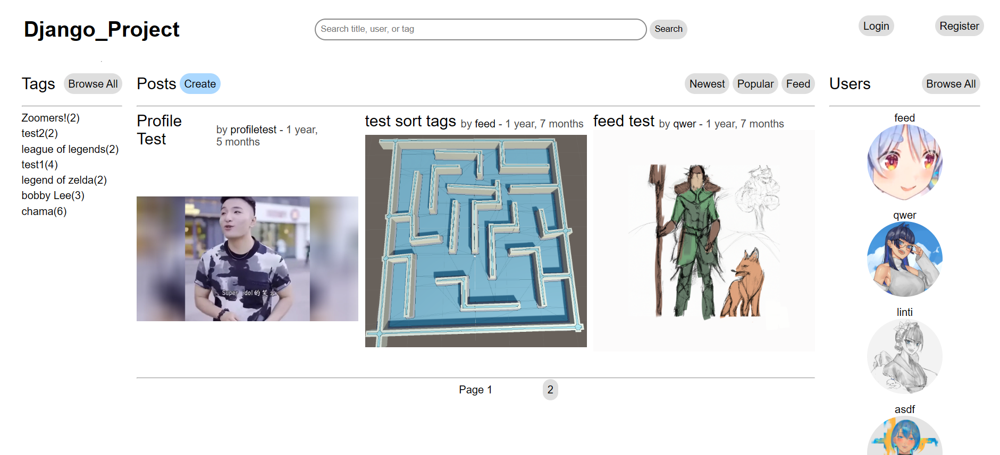

# Django Website

  This website was created using the [Django Framework](https://www.djangoproject.com/) using its fullstack capabilities.

  

## Features
- Users can create, edit, or delete accounts, posts, and comments
- Threaded commented system implemented with using a tree structure and depth-first search
- Search Posts, Users, and Tags
- Users can follow other accounts
